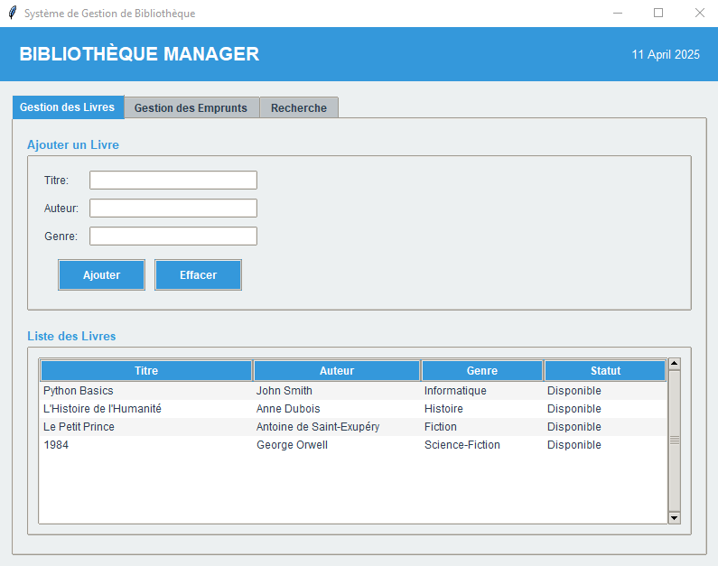

# 📚 Library Manager

A Python-based **Library Management System** with a stylish GUI using **Tkinter**.  
It allows users to add, remove, borrow, return, and search books. Features include an alphabetical sort, borrowing history, and a binary search tree for fast book lookup.

---

## 🖥️ Features

- 📘 Add, delete, and list books
- 🔍 Search books by title
- 📊 Sort books alphabetically
- 📚 Borrow and return books
- 📜 View borrowing history
- 🌳 Tree structure (Binary Search Tree) for efficient searching
- 🎨 Custom GUI theme with modern design using `ttk.Style`

---

### 🖥️ Main Interface

---

## 🛠️ Technologies Used

- Python 3.x
- Tkinter (standard GUI library)
- Object-Oriented Programming (OOP)
- Linked Lists and Binary Search Trees

---

## 🚀 How to Run

### Option 1: Run as a Standalone Executable (For Non-Developers)

1. Download the **executable** for Windows:
   - [Windows Executable (v1.0)](https://github.com/Msika01/library-manager-gui/releases/download/v1.0/library_manager.exe)

2. Simply double-click the `library_manager.exe` file to run the application.

   **Important Security Warning:**

   When you download the executable, Windows might show a warning message saying "Windows protected your PC."  
   This happens because the executable hasn't been signed with a trusted certificate. You can safely run the application by following these steps:

   1. **Right-click** on the executable file.
   2. Select **Properties**.
   3. At the bottom, you may see a message saying **"This file came from another computer and might be blocked to help protect this computer."**
   4. Click **Unblock** and then **Apply**.
   5. Click **OK** and then run the executable.

